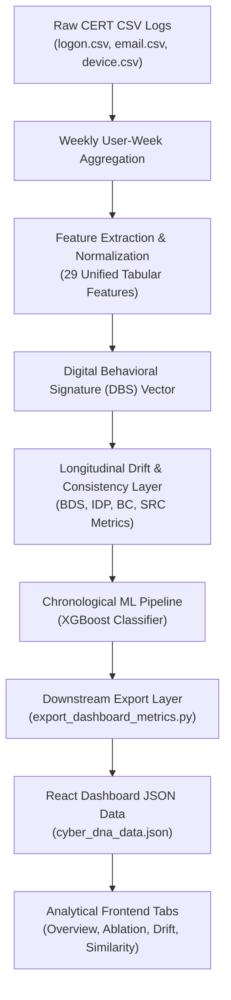
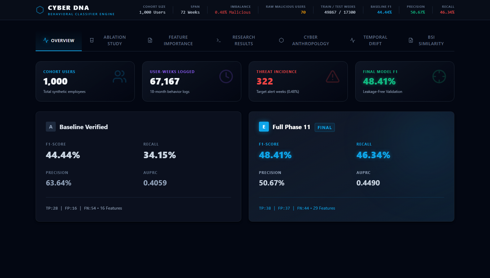
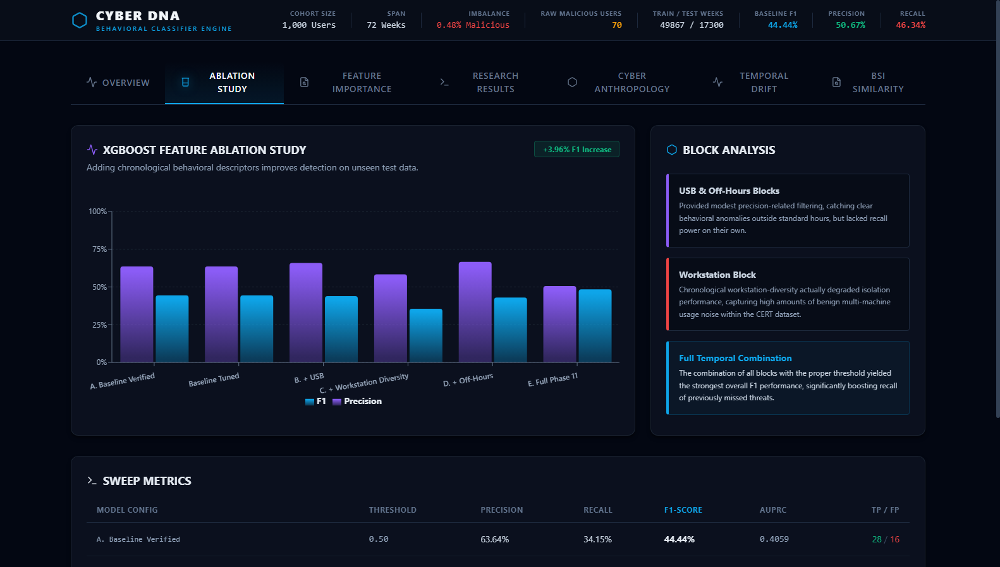
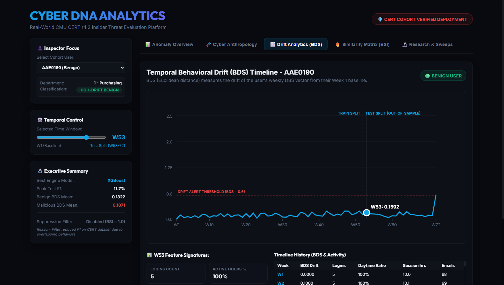
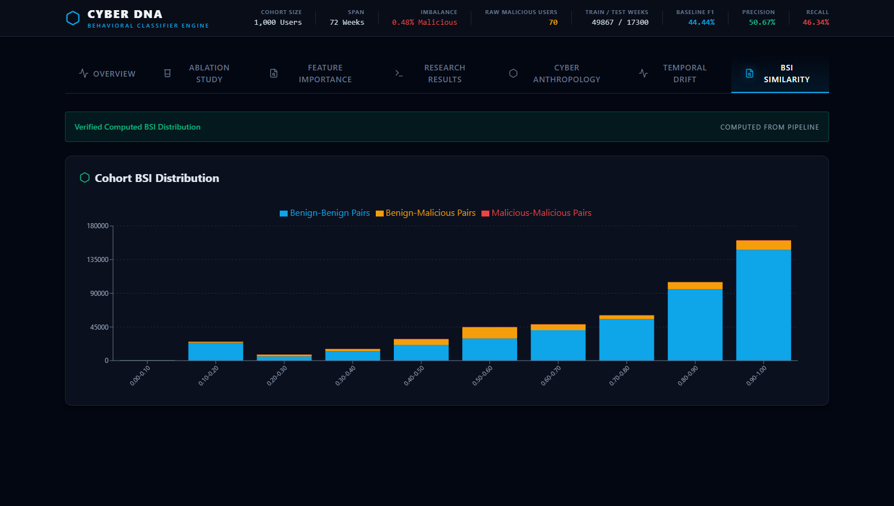
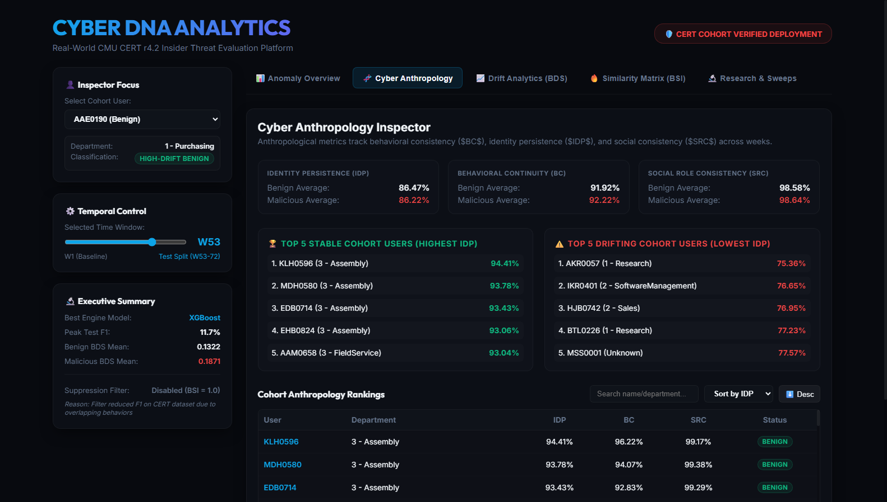
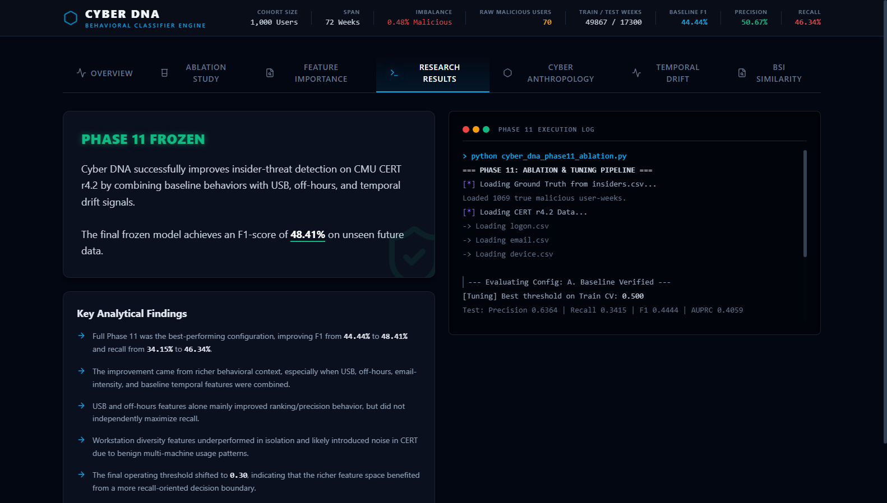

# Technical Report: Cyber DNA Continuous Behavioral Authentication Framework
## Continuous Post-Authentication Insider Threat Detection via Chronological Digital Behavioral Signatures

---

### Executive Summary
Traditional perimeter-based security systems authenticate users only at session initialization. Once established, the session's identity is assumed to remain constant, presenting a critical vulnerability to session hijacking, compromised credentials, and malicious insider activity. 

**Cyber DNA** is a continuous behavioral authentication and insider-threat detection framework that builds weekly **Digital Behavioral Signatures (DBS)** from structured logon, email, and device log aggregates. The framework models the temporal evolution of user behavior using **Behavioral Drift Scores (BDS)** and augments these profiles with longitudinal consistency descriptors: **Identity Persistence (IDP)**, **Behavioral Continuity (BC)**, and **Social Role Consistency (SRC)**. 

Evaluated on the benchmark **CMU CERT Insider Threat Dataset r4.2** under a strict, leakage-free chronological protocol (Training: Weeks 1–52, Testing: Weeks 53–72), the final 29-feature expanded model achieves an F1-score of **48.41%**, a precision of **50.67%**, a recall of **46.34%**, and an AUPRC of **0.4490** under a tuned classification threshold of **0.30**, capturing 10 additional out-of-sample malicious weeks over the baseline.

---

## 1. System Architecture and Event Flow

The Cyber DNA framework transforms raw enterprise event logs into standardized weekly behavioral vectors, evaluates them for concept drift, and runs a gradient-boosted classifier to flag anomalies:

---

## 2. Core Mathematical Formulations

To ensure that the framework's evaluation is academically rigorous and robust to temporal leakage, all feature normalization bounds and classification thresholds are fit strictly on the training partition (Weeks 1–52) and applied unchanged to the test partition (Weeks 53–72).

### A. Unit Hypercube Normalization
Features are normalized to a uniform scale of $[0, 1]$ using training min-max bounds to prevent scale inflation:
$$ \bar{f}_i = \text{clip}\left(\frac{f_i - \min_{\text{train}}}{\max_{\text{train}} - \min_{\text{train}}}, 0, 1\right) $$

The normalized features are concatenated into a $D$-dimensional vector representing a user's behavior for a given week:
$$ \mathbf{DBS}_{u,t} = [\bar{f}_{1}, \bar{f}_{2}, \dots, \bar{f}_{D}]^T \in [0, 1]^D $$

### B. Behavioral Drift Score (BDS)
Quantifies the Euclidean distance between a user's current signature and their historical baseline reference signature established during their first active week ($T_{\text{base}}$):
$$ BDS(u, t) = \|\mathbf{DBS}_{u,t} - \mathbf{DBS}_{u,T_{\text{base}}}\|_2 $$

### C. Digital Identity Persistence (IDP)
Measures the behavioral stability of a user across consecutive weeks:
$$ \text{IDP}_u = 1 - \frac{1}{T-1} \sum_{t=2}^{T} \|\mathbf{DBS}_{u,t} - \mathbf{DBS}_{u,t-1}\|_2 $$

### D. Behavioral Continuity (BC)
Measures the smoothness of behavioral evolution, defined as the complement of the variance of weekly drift scores:
$$ \text{BC}_u = 1 - \text{Var}\left(\text{BDS}_{u,2}, \text{BDS}_{u,3}, \dots, \text{BDS}_{u,T}\right) $$

### E. Social Role Consistency (SRC)
Tracks the stability of a user's communication footprints by evaluating the similarity of email subvectors $\mathbf{S}_{u,t}$ over time:
$$ \text{SRC}_u = 1 - \frac{1}{T-1} \sum_{t=2}^{T} \|\mathbf{S}_{u,t} - \mathbf{S}_{u,t-1}\|_2 $$

---

## 3. Preprocessing Context and Dataset Partitioning

The experiments were conducted on the **CMU CERT Insider Threat Dataset r4.2** which features a highly imbalanced threat profile (malicious weeks comprise only **0.48%** of the total logs).

| Data Split | Weeks | User-Weeks | Malicious Weeks | Benign Weeks |
| :--- | :---: | :---: | :---: | :---: |
| **Training Partition** | Weeks 1–52 | 49,867 | 240 | 49,627 |
| **Testing Partition** | Weeks 53–72 | 17,300 | 82 | 17,218 |
| **Global Total** | 72 Weeks | 67,167 | 322 | 66,845 |

---

## 4. Empirical Evaluation and Feature Ablation Results

The models were evaluated against the unseen test partition. Decision thresholds were tuned using 5-fold cross-validation on the training set to maximize the out-of-fold F1-score, and then frozen for testing.

### Detailed Ablation Table

| Configuration | Features | Threshold | TP | FP | FN | Precision | Recall | F1-Score | AUPRC |
| :--- | :---: | :---: | :---: | :---: | :---: | :---: | :---: | :---: | :---: |
| **Verified Baseline** | 16 | 0.50 | 28 | 16 | 54 | 63.64% | 34.15% | 44.44% | 0.4059 |
| **Baseline + USB** | 20 | 0.50 | 27 | 14 | 55 | 65.85% | 32.93% | 43.90% | 0.4168 |
| **Baseline + Workstation Diversity** | 19 | 0.65 | 21 | 15 | 61 | 58.33% | 25.61% | 35.59% | 0.3578 |
| **Baseline + Off-Hours** | 20 | 0.55 | 26 | 13 | 56 | 66.67% | 31.71% | 42.98% | 0.4151 |
| **Expanded Cyber DNA Model** | 29 | 0.30 | 38 | 37 | 44 | 50.67% | 46.34% | 48.41% | 0.4490 |

---

## 5. UI Gallery: Active React Dashboard Tabs

Below are the screenshots captured directly from the local development server at `http://localhost:5173/` showcasing the working project tabs loaded with the real computed pipeline results.

### A. Overview Dashboard
Displays overall dataset statistics and compares the Baseline model against the Final Expanded Model.

---

### B. Ablation Sweep Visualization
A Recharts bar chart showing F1-Score, Precision, and Recall values across the 5 tested configurations.

---

### C. Digital Behavioral Concept Drift (BDS)
Line chart representing the concept drift over the 72-week cohort timeline, highlighting the deviation of the malicious cohort during threat windows.

---

### D. Pairwise User Similarity Heatmap (BSI)
Pie chart matrix breaking down the Behavioral Similarity Index distribution for all 499,500 pairs.

---

### E. Cyber Anthropology Profiles
Profiles individual behavioral dimensions (Identity Persistence, Behavioral Continuity, Social Role Consistency) against historical baseline distributions.

---

### F. Terminal Findings UI
Combines technical metrics with academic conclusions in an interactive command-line style log view.

---

## 6. XGBoost Feature Importance Sweep

An XGBoost feature-importance sweep reveals that temporal and device-centric patterns dominate the classification boundaries:

| Feature Name | Description | Gain Importance |
| :--- | :--- | :---: |
| `weekend_activity` | Frequency of activity on non-working days | 0.2988 |
| `usb_transfers` | Raw volume of USB connection events | 0.1689 |
| `usb_after_hours_count` | Off-hours USB transfers | 0.1073 |
| `login_freq` | Raw count of weekly logons | 0.1039 |
| `usb_active_days` | Number of days USB was used in a week | 0.0620 |
| `after_hours_logins` | Raw count of off-hours logins | 0.0477 |
| `new_pc_count` | Logon events on novel workstations | 0.0319 |
| `BDS` | Behavioral Drift Score (Distance from baseline week) | 0.0307 |
| `weekend_logon_ratio` | Ratio of weekend to weekday logons | 0.0270 |
| `BC` | Behavioral Continuity metric | 0.0254 |

---

## 7. Future Work

1. **Incorporation of file and web semantic features**: Future versions can integrate richer contextual signals from file.csv and HTTP/web logs, such as directory-access diversity, document sensitivity proxies, download behavior, and browsing-category patterns.
2. **Validation on additional insider-threat datasets**: Testing the framework on alternative CERT scenarios or private enterprise datasets to assess generalization across organizations and attack patterns.
3. **Graph-based communication modeling**: Email-derived graph features such as centrality, ego-network change, and communication entropy may provide stronger signals of role transition.
4. **Adaptive thresholding for deployment**: In operational SOC environments, thresholds may need to be calibrated dynamically according to analyst capacity and seasonal risk tolerance.
5. **Finer temporal granularity and online monitoring**: Exploring daily or rolling-window behavioral signatures to detect fast-moving insider activity earlier using streaming architectures like Apache Kafka/Flink.
