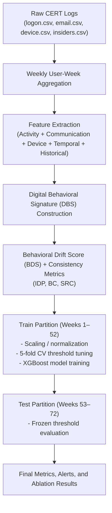

# Cyber DNA: A Leakage-Free Behavioral Authentication Framework for Insider Threat Detection Using Temporal User Modeling

## Abstract
Traditional enterprise authentication mechanisms verify users only at login and do not continuously validate identity throughout an active session, leaving organizations vulnerable to insider misuse and compromised authenticated accounts. This project presents Cyber DNA, a behavioral authentication and insider-threat monitoring framework that models users through weekly Digital Behavioral Signatures (DBS) derived from enterprise logon, email, and device activity. Cyber DNA augments these signatures with longitudinal features including Behavioral Drift Score (BDS) and behavioral consistency descriptors such as Identity Persistence (IDP), Behavioral Continuity (BC), and Social Role Consistency (SRC).

The framework is evaluated on the CMU CERT Insider Threat Dataset r4.2 under a strict leakage-free chronological protocol, using Weeks 1–52 for training and Weeks 53–72 for testing. A verified baseline model using 16 features achieved 44.44% F1, 63.64% precision, 34.15% recall, and 0.4059 AUPRC. An expanded model incorporating USB behavior, workstation-diversity history, off-hours activity, and email-intensity features improved performance to 48.41% F1, 50.67% precision, 46.34% recall, and 0.4490 AUPRC, while detecting 10 additional malicious weeks on the unseen test partition. These results show that richer temporal, device-aware, and off-hours behavioral context can improve insider-threat detection under a realistic chronological evaluation setting, while also highlighting the trade-off between recall improvement and false-positive volume in highly imbalanced enterprise threat data.

---

## List of Abbreviations
- **AUPRC**: Area Under the Precision-Recall Curve
- **BC**: Behavioral Continuity
- **BDS**: Behavioral Drift Score
- **CERT**: Computer Emergency Response Team (CMU dataset)
- **DBS**: Digital Behavioral Signature
- **IDP**: Identity Persistence
- **SOC**: Security Operations Center
- **SRC**: Social Role Consistency
- **UEBA**: User and Entity Behavior Analytics

---

## 1. Introduction

### Motivation
Modern digital environments allow individuals to interact across enterprise systems, communication platforms, and online services. While perimeter defenses and initial authentication (e.g., passwords, multi-factor authentication) are essential, they are fundamentally binary point-in-time checks. They fail to continuously verify user identity or detect malicious behavioral deviations (insider threats) over time. Traditional attribution and anomaly detection methods rely on technical indicators such as IP addresses, device fingerprints, authentication logs, and network metadata. However, these indicators can be altered, concealed, or legitimately shared, reducing their reliability for long-term behavioral analysis. Human behavioral characteristics are often more persistent than technical identifiers.

### Research Gap
Current insider-threat systems either rely on static anomaly scores, use opaque UEBA risk scoring, or ignore longitudinal behavioral evolution. Most existing CERT studies focus on detecting anomalous activity within a fixed feature space and do not explicitly model continuous behavioral authentication using temporal drift and consistency metrics under a leakage-free chronological protocol. Cyber DNA addresses this gap by integrating weekly behavioral signatures, drift analysis, longitudinal consistency descriptors, and expanded device-aware behavioral features within a unified framework. In practical enterprise security settings, insider-threat detection systems must operate under two competing constraints: they must identify rare malicious activity with limited false alarms, and they must do so without relying on evaluation protocols that leak future information into model training. This work is motivated by that gap.

### Research Objectives
This project develops and evaluates a continuous behavioral authentication framework for enterprise environments that can detect insider-threat activity from longitudinal user behavior. The specific objectives are:
- To construct weekly Digital Behavioral Signatures (DBS) from enterprise logon, email, and device logs.
- To model behavioral drift and consistency over time using temporal and behavioral consistency metrics.
- To evaluate insider-threat detection performance under a strict leakage-free chronological split on the CMU CERT r4.2 dataset.
- To investigate whether expanding the behavioral feature space with USB activity, workstation-diversity history, and off-hours activity improves out-of-sample detection quality.
- To identify the precision-recall tradeoffs introduced by threshold tuning in highly imbalanced insider-threat settings.

### Contributions of this work
- **Proposed Cyber DNA framework** for continuous authentication using weekly digital behavioral signatures.
- **Introduced behavioral drift and consistency metrics** to dynamically model how user behavior evolves over time.
- **Built a leakage-free CERT r4.2 evaluation pipeline** utilizing a strict chronological split to ensure defensible metrics.
- **Extended the baseline with expanded features**, integrating USB tracking, off-hours activity, workstation-diversity, and email-intensity into a unified model.
- **Conducted an ablation study and threshold tuning** directly on the training partition to isolate the value of different behavioral blocks.
- **Achieved best leakage-free performance** of 48.41% F1 / 46.34% recall / 0.4490 AUPRC on the unseen test split.

---

## 2. Related Work

### 2.1 CERT-based insider threat detection
Insider-threat detection has been widely studied using enterprise activity logs such as logon records, emails, removable-media usage, and file-access traces. The CMU CERT Insider Threat Dataset is one of the most widely used academic benchmarks for this purpose, enabling controlled experimentation on simulated malicious scenarios embedded within enterprise behavior streams. Prior research on CERT-style data has explored both unsupervised anomaly detection and supervised classification over aggregated user activity patterns [1, 2]. Unsupervised methods are attractive because they do not require many labeled malicious examples, but they often suffer from high false-positive rates due to normal behavioral variability. Supervised approaches can achieve better discrimination when meaningful features are available, but they are highly sensitive to class imbalance and evaluation leakage if temporal ordering is not respected [3].

### 2.2 UEBA and enterprise behavior analytics
Commercial User and Entity Behavior Analytics (UEBA) systems attempt to baseline user activity and assign risk scores when observed behavior deviates from historical norms [4]. These platforms often aggregate indicators such as login counts, device usage, access anomalies, or unusual communication activity into heuristic risk scores. However, many operational UEBA systems still rely heavily on event counting, static thresholds, or opaque vendor scoring logic. Such approaches can produce large numbers of false positives when benign users undergo natural changes in role, project, workstation usage, or work schedule [5]. 

### 2.3 Behavioral biometrics and continuous authentication
Behavioral biometrics such as keystroke dynamics, mouse movement, stylometry, and application-usage patterns have been explored for continuous authentication and user attribution [6]. These methods can capture persistent user-specific characteristics, but they often require fine-grained data capture, expensive preprocessing, or intrusive telemetry [7]. 

### 2.4 Temporal drift and longitudinal behavioral modeling
A key challenge in long-term behavior analytics is concept drift: user behavior naturally changes over time because of promotions, project changes, department transfers, workload shifts, or seasonal activity patterns [8]. Static anomaly models may incorrectly treat such benign evolution as malicious deviation [9]. This is especially important in insider-threat settings, where the goal is to detect true malicious misuse without overwhelming analysts with false alarms caused by legitimate role transitions.

### Positioning of Cyber DNA
Cyber DNA differs from existing systems by framing insider-threat monitoring as a continuous behavioral authentication problem rather than only a one-shot anomaly scoring task. It explicitly models how a user’s behavior evolves over time, rather than treating every deviation from a static baseline as equally suspicious. Finally, it validates the framework using a strict leakage-free chronological evaluation protocol on CERT r4.2 and measures the impact of feature expansion through a dedicated ablation study.

---

## 3. Problem Statement
Current cybersecurity investigations rely primarily on technical identifiers that can be manipulated or hidden. Existing behavioral analysis approaches often focus on individual techniques such as stylometry, behavioral biometrics, or activity monitoring without integrating multiple behavioral dimensions. Furthermore, most existing approaches analyze behavior at a single point in time and do not consider how digital behavior evolves. Because standard perimeter authentication only checks identity at the point of entry, authenticated sessions are highly vulnerable to insider threats or session hijacking. There is a need for a unified framework capable of combining behavioral patterns, communication characteristics, device usage, identity persistence indicators, and behavioral evolution metrics to generate comprehensive Digital Behavioral Signatures for continuous authentication and insider-threat detection.

---

## 4. Dataset and Preprocessing Context

### Dataset Source
The experiments were conducted on the CMU CERT Insider Threat Dataset r4.2, a widely used academic benchmark for insider-threat detection research. The dataset contains simulated enterprise activity logs spanning approximately 1.5 years for 1,000 users, including logon events, email activity, removable-media usage, and ground-truth insider scenarios. Ground-truth malicious periods were derived from the provided insiders.csv annotation file.

Although CERT r4.2 includes additional sources such as file-access and HTTP logs, the final verified pipeline in this study uses logon.csv, email.csv, device.csv, LDAP context, and insiders.csv for labels, with weekly features engineered from logon, email, and device activity only. This also allowed the study to evaluate whether meaningful insider-threat detection can be achieved without relying on high-dimensional content or file-path semantics. 

### Dataset Statistics
| Metric | Value |
| :--- | :--- |
| Users | 1,000 |
| Total User-Weeks | 67,167 |
| Malicious Weeks | 322 |
| Benign Weeks | 66,845 |
| Malicious Ratio | 0.48% |
| Train User-Weeks (Weeks 1–52) | 49,867 |
| Train Malicious Weeks | 240 |
| Train Benign Weeks | 49,627 |
| Test User-Weeks (Weeks 53–72) | 17,300 |
| Test Malicious Weeks | 82 |
| Test Benign Weeks | 17,218 |

---

## 5. Cyber DNA Framework

### 5.1 Overall pipeline
Figure 1 presents the end-to-end Cyber DNA workflow from raw enterprise log ingestion to leakage-free evaluation and final alert generation.

*Figure 1. End-to-end Cyber DNA pipeline showing weekly aggregation, feature extraction, drift/consistency computation, leakage-free training, threshold tuning, and final test-time alert generation.*

**Weekly Aggregation**
Weekly aggregation was selected as a compromise between behavioral stability and temporal resolution. Daily activity in enterprise logs is often noisy and sparse for many users, whereas monthly aggregation can hide short-lived but meaningful deviations. Weekly behavioral signatures provide enough observations to stabilize counts such as email activity, USB events, and workstation usage while still preserving the temporal evolution required for drift analysis.

**Leakage-Free Chronology**
To strictly prevent temporal leakage, historical features are computed only from weeks prior to the current week being evaluated. The framework was implemented in Python using structured weekly aggregation of CERT activity logs and evaluated with an XGBoost classifier under a strict chronological training and testing protocol.

### 5.2 Behavioral feature construction
Cyber DNA ingests raw, disparate log files and processes them into structured weekly intervals. The feature space consists of:
- **Baseline features**: Standard event counts and ratios (e.g., login frequency, average session duration).
- **Expanded features**: Granular off-hours tracking, dedicated USB behavioral counts, and email-intensity markers.
- **Historical features**: Features such as `new_pc_count` that trace whether a user is interacting with an entity they have never accessed before in their recorded history.

### 5.3 Temporal and consistency metrics
To avoid feature-range inflation while preserving leakage-free evaluation, raw features $f_i$ are normalized to the unit hypercube using min-max bounds estimated from the training partition and then applied unchanged to the test partition.

The weekly **Digital Behavioral Signature (DBS)** vector is defined across multiple behavioral layers.

For each user, the **Behavioral Drift Score (BDS)** compares the current week’s behavioral signature against that user’s earliest available active week in the observation history:
$$ BDS(U, T_{\text{base}}, W) = \|\mathbf{DBS}_{U, W} - \mathbf{DBS}_{U, T_{\text{base}}}\|_2 $$

The framework also incorporates:
- **Digital Identity Persistence (IDP)**: Measures the stability of a user's behavior over time using consecutive weekly signature transitions:
$$ \text{IDP}_u = 1 - \frac{1}{T-1} \sum_{t=2}^{T} \|\mathbf{DBS}_{u,t} - \mathbf{DBS}_{u,t-1}\|_2 $$
- **Behavioral Continuity (BC)**: Measures how smoothly behavioral characteristics are maintained across activities by examining the variance of weekly drift changes:
$$ \text{BC}_u = 1 - \text{Var}(\text{BDS}_{u,2}, \text{BDS}_{u,3}, \ldots, \text{BDS}_{u,T}) $$
- **Social Role Consistency (SRC)**: Measures stability in communication and interaction styles based on weekly interaction footprints:
$$ \text{SRC}_u = 1 - \frac{1}{T-1} \sum_{t=2}^{T} \|\mathbf{S}_{u,t} - \mathbf{S}_{u,t-1}\|_2 $$

Here, $T$ denotes the number of observed weeks for user $u$, and $\mathbf{S}_{u,t}$ denotes the communication/interaction subvector used to represent social-role behavior at week $t$. These metrics provide higher-level behavioral context that may interact non-linearly with temporal signals.

### 5.4 Final model feature sets
**Verified Baseline Feature Set (16 features)**
The verified baseline model used the following 16 features: `login_freq`, `active_hours_ratio`, `avg_session_duration`, `workstation_diversity`, `after_hours_logins`, `weekend_activity`, `email_freq`, `contact_diversity`, `vocab_diversity`, `reciprocity_ratio`, `response_time`, `usb_transfers`, `BDS`, `IDP`, `BC`, `SRC`.

**Expanded Cyber DNA Model Additional Features**
The expanded model added the following feature blocks, totaling 29 features:
- **USB block**: `usb_event_count`, `usb_active_days`, `usb_after_hours_count`, `usb_weekend_count`
- **Workstation-diversity block**: `unique_pc_count`, `new_pc_count`, `pc_switch_count`
- **Off-hours block**: `after_hours_logon_count`, `after_hours_logon_ratio`, `weekend_logon_count`, `weekend_logon_ratio`
- **Email-intensity block**: `emails_sent_after_hours`, `emails_sent_weekend`

---

## 6. Technical Implementation Overview

### 6.1 Pipeline Implementation
The Cyber DNA pipeline was implemented in Python using Pandas, NumPy, and XGBoost. The raw CERT log files (`logon.csv`, `email.csv`, `device.csv`) were transformed into weekly user-level behavioral summaries through structured aggregation over user-week windows. To support leakage-free evaluation, all preprocessing, feature construction, normalization, and threshold selection were performed using a strict chronological protocol in which Weeks 1–52 formed the training partition and Weeks 53–72 formed the testing partition.

The final implementation consists of three major stages:
- **Weekly feature extraction**, where logon, email, and device events are aggregated into per-user weekly behavioral features.
- **Temporal feature construction**, where historical descriptors such as Behavioral Drift Score (BDS), Identity Persistence (IDP), Behavioral Continuity (BC), and Social Role Consistency (SRC) are computed from user behavior over time.
- **Leakage-free model evaluation**, where XGBoost is trained on the training partition, thresholds are tuned only using training-set cross-validation, and final performance is measured once on the unseen test partition.

### 6.2 Final Repository Structure
The final repository is organized around a small set of reproducible components:
- `cyber_dna_phase11_ablation.py` — main leakage-free training and ablation pipeline
- `src/export_to_web.py` — deterministic exporter that converts final Phase 11 metrics into dashboard-ready JSON
- `results/` — final ablation metrics, feature importance tables, run summary, and findings
- `web_app/` — React-based research dashboard for presenting the frozen final results

### 6.3 Dashboard Implementation
To support presentation and interpretation of the final results, a lightweight React dashboard was built around the final Phase 11 artifacts. The dashboard does not retrain models or recompute features; instead, it reads the exported JSON produced from the validated results and presents the final performance story through four views:
- **Overview** — dataset summary and final model comparison
- **Ablation Study** — comparison of baseline and expanded feature configurations
- **Feature Importance** — ranking of the most influential features in the final expanded model
- **Research Results** — consolidated findings, threshold behavior, and final conclusions

This design ensures that the interface remains consistent with the frozen evaluation artifacts and functions as a presentation layer rather than an independent analytical pipeline.

---

## 7. Experimental Design and Evaluation Protocol

### 6.1 Data partitioning
To prevent temporal data leakage and represent a realistic deployment model, the dataset is split strictly chronologically. This is critical for defending the validity of the results in a real-world continuous authentication context.
- **Training Partition (Weeks 1 to 52)**: 49,867 user-weeks (240 malicious).
- **Testing Partition (Weeks 53 to 72)**: 17,300 user-weeks (82 malicious). This represents unseen future data.

### 6.2 Model training
XGBoost was selected as the primary classifier because it performs well on structured tabular data, supports non-linear interactions between heterogeneous behavioral features, and provides built-in mechanisms to handle severe class imbalance. Specifically, class imbalance is handled via the `scale_pos_weight` parameter to ensure the model attends to the rare malicious class.

### 6.3 Threshold tuning
Threshold selection is performed strictly on the training partition using 5-fold stratified cross-validation. Candidate decision boundaries are swept and evaluated using the F1-score on out-of-fold predictions. The F1-selected threshold is then frozen and applied to the unseen testing partition.

### 6.4 Metrics
Because malicious weeks account for only 0.48% of all user-weeks, a naive classifier that predicts every week as benign would achieve extremely high overall accuracy while detecting no threats. For this reason, accuracy is not a meaningful metric for this problem. Evaluation focuses on **precision**, **recall**, **F1-score**, and **AUPRC**. AUPRC is one of the most informative summary metrics because it reflects ranking quality under extreme class imbalance more faithfully than accuracy or ROC-based measures.

---

## 8. Final Model Results

This section presents the final leakage-free performance of Cyber DNA on the CMU CERT r4.2 dataset. The verified baseline model establishes the defensible reference point, while the Expanded Cyber DNA Model evaluates whether richer device-aware, temporal, and workstation-history features improve insider-threat detection on unseen future weeks. 

### Baseline vs Expanded Cyber DNA Model

| Model | Precision | Recall | F1-Score | AUPRC |
| :--- | :--- | :--- | :--- | :--- |
| **Verified Baseline** | 63.64% | 34.15% | 44.44% | 0.4059 |
| **Expanded Cyber DNA Model** | 50.67% | 46.34% | 48.41% | 0.4490 |

Compared to the Verified Baseline:
- Recall improved by 35.7% relative (34.15% → 46.34%)
- F1 improved by 8.9% relative (44.44% → 48.41%)
- AUPRC improved by 10.6% relative (0.4059 → 0.4490)

Although the expanded model reduced precision relative to the verified baseline, it recovered 10 additional malicious weeks on the unseen test set. In an operational SOC context, this trade-off may be acceptable when the goal is to improve analyst visibility into potentially harmful insider activity, provided that alert volumes remain manageable.

### Confusion Matrix Interpretation
For the Verified Baseline, the model produced 28 true positives, 16 false positives, and 54 false negatives on the malicious class.
For the Expanded Cyber DNA Model, the model produced 38 true positives, 37 false positives, and 44 false negatives.
This confirms that the improved recall was achieved by surfacing more suspicious weeks at the cost of a higher alert volume. In practice, these false positives should be interpreted as additional analyst review candidates rather than definitive malicious incidents.

### Threshold Effect
For the Verified Baseline, the best training threshold was 0.50. For the Expanded Cyber DNA Model, the optimal threshold shifted downward to 0.30, showing that the richer feature representation benefited from a more recall-oriented operating point.

---

## 9. Ablation Study of Expanded Behavioral Feature Blocks

To understand how the Expanded Cyber DNA Model improved performance, we conducted a strict ablation study by sequentially adding feature blocks to the Verified Baseline.

| Configuration | Threshold | Precision | Recall | F1-Score | AUPRC |
| :--- | :--- | :--- | :--- | :--- | :--- |
| **Verified Baseline** | 0.50 | 63.64% | 34.15% | 44.44% | 0.4059 |
| **Baseline + USB** | 0.50 | 65.85% | 32.93% | 43.90% | 0.4168 |
| **Baseline + Workstation Diversity**| 0.65 | 58.33% | 25.61% | 35.59% | 0.3578 |
| **Baseline + Off-Hours** | 0.55 | 66.67% | 31.71% | 42.98% | 0.4151 |
| **Expanded Cyber DNA Model** | 0.30 | 50.67% | 46.34% | 48.41% | 0.4490 |

### Top Expanded Features (Gain Importance)
| Feature | Importance |
| :--- | :--- |
| `weekend_activity` | 0.2988 |
| `usb_transfers` | 0.1689 |
| `usb_after_hours_count` | 0.1073 |
| `login_freq` | 0.1039 |
| `usb_active_days` | 0.0620 |
| `after_hours_logins` | 0.0477 |
| `new_pc_count` | 0.0319 |
| `BDS` | 0.0307 |
| `weekend_logon_ratio` | 0.0270 |
| `BC` | 0.0254 |

Several expanded communication and anthropology-related features received near-zero gain importance in the final model. This suggests that, within CERT r4.2, the strongest discriminatory signals came primarily from temporal activity patterns and device-related behavior rather than communication-style descriptors alone.

---

## 10. Discussion

### 11.1 Interpretation of ablation findings
USB-derived activity appears to contribute contextual discrimination, but in isolation it was insufficient to materially improve recall. Off-hours behavior similarly acted as a precision refinement signal rather than a direct threat detector on its own. Chronological workstation-diversity indicators such as `new_pc_count` likely introduced noise due to benign multi-machine usage patterns. When combined, the expanded behavioral space materially improved recall and overall F1.

### 11.2 Practical deployment implications
In a real SOC deployment, the Expanded Cyber DNA Model would function as a prioritization layer that surfaces suspicious user-weeks for analyst review. The increase in false positives associated with the recall-oriented threshold is acceptable if the system consistently identifies additional true malicious weeks that would otherwise be missed. The operational value depends on how alert volumes align with analyst workload and incident triage workflows. In operational environments with very strict alert budgets, a higher-precision operating point such as the Verified Baseline may still be preferable.

### 10.3 What the feature importance results imply
The ablation results suggest that insider-threat detection performance on CERT is driven less by any single feature block in isolation and more by the interaction between temporal activity patterns, device usage, and behavioral history. This indicates that continuous authentication in enterprise environments benefits from combining multiple weak behavioral signals into a unified longitudinal model rather than relying on any single heuristic indicator.

---

## 11. Threats to Validity and Limitations

### 11.1 Internal / methodological limitations
- **Extreme class imbalance**: Malicious weeks are exceedingly rare, making stable learning difficult and threshold selection sensitive to small changes.
- **Weekly aggregation constraints**: Because the framework aggregates activity at the weekly level, very short-lived attack bursts may be smoothed into broader behavioral summaries and become harder to isolate.
- **Weak standalone anthropology metrics**: IDP, BC, and SRC did not strongly separate benign and malicious users when considered individually. Their role is better understood as auxiliary consistency descriptors that contribute through interaction with other features.
- **Threshold sensitivity**: Improving recall substantially introduces more false positives due to a lower decision boundary.

### 11.2 External validity limitations
- **Single dataset evaluation (CERT r4.2)**: Results may not directly translate to different organizations, as different enterprises have different interaction norms.
- **Simulated enterprise benchmark**: Threat scenarios are simulated rather than organically occurring.
- **No semantic visibility**: The raw log features lack rich semantics such as exact file contents or deep packet inspection.

---

## 12. Future Work

1. **Incorporation of file and web semantic features**: Future versions can integrate richer contextual signals from file.csv and HTTP/web logs, such as directory-access diversity, document sensitivity proxies, download behavior, and browsing-category patterns. 
2. **Validation on additional insider-threat datasets**: Testing the framework on alternative CERT scenarios or private enterprise datasets to assess generalization across organizations and attack patterns.
3. **Graph-based communication modeling**: Email-derived graph features such as centrality, ego-network change, and communication entropy may provide stronger signals of role transition.
4. **Adaptive thresholding for deployment**: In operational SOC environments, thresholds may need to be calibrated dynamically according to analyst capacity and seasonal risk tolerance.
5. **Finer temporal granularity and online monitoring**: Exploring daily or rolling-window behavioral signatures to detect fast-moving insider activity earlier using streaming architectures like Apache Kafka/Flink.

---

## 13. Conclusion

This project presented Cyber DNA, a behavioral authentication framework for insider-threat detection based on weekly temporal user modeling over enterprise activity logs. The framework combines Digital Behavioral Signatures (DBS) with drift-oriented and longitudinal consistency features to model how user behavior evolves over time, and evaluates these signals under a strict leakage-free chronological protocol on the CMU CERT r4.2 dataset.

Three conclusions emerge from the study. First, the project establishes a defensible leakage-free baseline for CERT-based insider-threat detection by enforcing chronological training/testing separation, train-only normalization, and train-only threshold tuning. Second, expanding the baseline with richer behavioral context — particularly USB usage, off-hours behavior, and workstation-history features — improved malicious-week detection on the unseen test partition, increasing F1-score from 44.44% to 48.41% and recall from 34.15% to 46.34%, while recovering 10 additional malicious weeks. Third, the ablation results show that the strongest signals in CERT r4.2 arise from temporal and device-aware behavioral cues, while several communication-oriented and anthropology-inspired features contribute only weakly in isolation.

Overall, the results indicate that continuous behavioral authentication for insider-threat monitoring is feasible using structured enterprise logs when evaluated under a realistic chronological setting. While the current framework remains limited by the constraints of CERT r4.2 and the scarcity of malicious samples, it provides a strong foundation for future extensions involving richer semantic features, communication-graph modeling, and deployment-aware thresholding.

---

## 14. References
[1] W. Eberle and L. Holder, "Anomaly detection in data represented as graphs," *Intelligent Data Analysis*, vol. 11, no. 6, pp. 663-689, 2009.

[2] A. Tuor, S. Kaplan, B. Hutchinson, N. Nichols, and S. Robinson, "Deep learning for unsupervised insider threat detection in structured cybersecurity data streams," in *Proc. AAAI Workshop on Artificial Intelligence for Cyber Security*, 2017, pp. 1-8.

[3] B. Lindauer, J. Glasser, M. Rosen, K. Wallnau, and M. Mellinger, "Generating test data for insider threat detectors," *J. Wireless Mobile Networks, Ubiquitous Computing, and Dependable Applications*, vol. 5, no. 2, pp. 80-94, 2014.

[4] M. B. Salem, S. Hershkop, and S. J. Stolfo, "A survey of insider attack detection research," *Insider Attack and Cyber Security*, vol. 39, pp. 69-90, 2008.

[5] I. Homoliak et al., "Insight into insiders and IT: A survey of insider threat taxonomies, analysis, modeling, and countermeasures," *ACM Computing Surveys (CSUR)*, vol. 52, no. 2, pp. 1-40, 2019.

[6] L. Broderick et al., "Active authentication on mobile devices via stylometry, application usage, web browsing, and GPS location," in *Proc. IEEE Security and Privacy Workshops*, 2013, pp. 112-118.

[7] B. Alsulami et al., "Biometric keystroke dynamics for continuous authentication," *IEEE Access*, vol. 6, pp. 24404-24416, 2018.

[8] J. Gama, I. Zliobaite, A. Bifet, M. Pechenizkiy, and A. Bouchachia, "A survey on concept drift adaptation," *ACM Computing Surveys (CSUR)*, vol. 46, no. 4, pp. 1-37, 2014.

[9] T. Chen and C. Guestrin, "XGBoost: A scalable tree boosting system," in *Proc. 22nd ACM SIGKDD Int. Conf. on Knowledge Discovery and Data Mining*, 2016, pp. 785-794.

[10] B. Lindauer, "Insider Threat Test Dataset," Carnegie Mellon University CERT Division / SEI, Dataset Release, 2020. [Online]. Available: https://doi.org/10.1184/R1/12841247.v1

---

## Appendix A — Feature Dictionary
| Feature | Description |
| :--- | :--- |
| `login_freq` | Number of logins per week |
| `active_hours_ratio` | Ratio of active hours to total hours in a week |
| `avg_session_duration` | Average duration of user sessions |
| `workstation_diversity` | Number of distinct workstations used in a given week |
| `after_hours_logins` | Count of logons outside standard business hours |
| `weekend_activity` | Baseline weekly indicator of weekend logon activity |
| `email_freq` | Total number of emails sent per week |
| `contact_diversity` | Number of unique recipients contacted |
| `vocab_diversity` | Lexical diversity in email subjects/contents |
| `reciprocity_ratio` | Ratio of emails sent versus received |
| `response_time` | Average time taken to reply to an email |
| `usb_transfers` | Total count of USB connection events |
| `BDS` | Behavioral Drift Score (Euclidean distance from baseline week) |
| `IDP` | Identity Persistence (stability across consecutive weeks) |
| `BC` | Behavioral Continuity (variance of weekly drift changes) |
| `SRC` | Social Role Consistency (stability in interaction footprints) |
| `usb_event_count` | Total raw volume of USB events |
| `usb_active_days` | Number of distinct days USB was used |
| `usb_after_hours_count` | USB events occurring outside business hours |
| `usb_weekend_count` | USB events occurring on weekends |
| `unique_pc_count` | Number of distinct workstations used in the current week |
| `new_pc_count` | Novel workstations never seen in previous weeks |
| `pc_switch_count` | Frequency of switching between distinct workstations |
| `after_hours_logon_count` | Number of logon events outside business hours |
| `after_hours_logon_ratio` | Ratio of after-hours logons to total logons |
| `weekend_logon_count` | Number of weekend logon events in the week |
| `weekend_logon_ratio` | Ratio of weekend logons to total logons |
| `emails_sent_after_hours` | Number of emails sent outside business hours |
| `emails_sent_weekend` | Number of emails sent on weekends |

## Appendix B — Final Results Table
| Configuration | Threshold | Precision | Recall | F1-Score | AUPRC |
| :--- | :--- | :--- | :--- | :--- | :--- |
| **Verified Baseline** | 0.50 | 63.64% | 34.15% | 44.44% | 0.4059 |
| **Baseline + USB** | 0.50 | 65.85% | 32.93% | 43.90% | 0.4168 |
| **Baseline + Workstation Diversity**| 0.65 | 58.33% | 25.61% | 35.59% | 0.3578 |
| **Baseline + Off-Hours** | 0.55 | 66.67% | 31.71% | 42.98% | 0.4151 |
| **Expanded Cyber DNA Model** | 0.30 | 50.67% | 46.34% | 48.41% | 0.4490 |

## Appendix C — Artifact Summary
The final validated performance metrics are backed by the following generated evaluation artifacts:
- `results/phase11_ablation_metrics.csv`
- `results/phase11_feature_importance.csv`
- `results/phase11_feature_inventory.csv`
- `results/phase11_run_summary.json`
- `results/phase11_findings.md`
- `src/export_dashboard_metrics.py` (Downstream metrics exporter)
- `results/dashboard_temporal_drift.csv` (Computed temporal concept drift curves)
- `results/dashboard_bsi_distribution.csv` (Computed pairwise user similarity counts)
- `results/dashboard_metrics_summary.json` (Traceable dashboard metadata with explicit cohort pair-count validation)
- React visualization dashboard linked to `web_app/src/cyber_dna_data.json`

